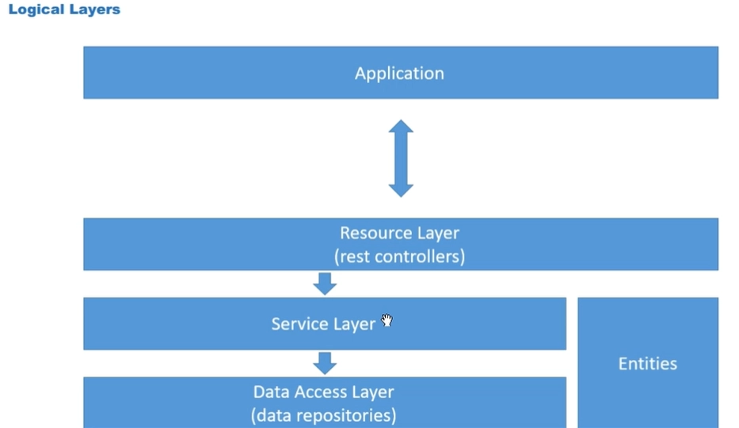

Essa será a arquitetura do projeto:


- O banco de dados local H2 pode ser acessado em [localhost:8080/h2-console](http://localhost:8080/h2-console)
- `@Autowired` realiza a injeção de dependência automaticamente. A classe que vai ser injetada deve estar registrada como componente do Spring, com `@Component` ou `@Service` ou outra coisa
- Essa costuma ser a implementação padrão de um Enum, e resolve o problema de 'Um novo enum é adicionado no meio, então todos os enums na frente dele mudam de número'
```java
public enum OrderStatus {
  WAITING_PAYMENT(1),
  PAID(2),
  SHIPPED(3),
  DELIVERED(4),
  CANCELLED(5);

  private int code;

  OrderStatus(int code) {
    this.code = code;
  }
  
  public int getCode() {
    return code;
  }

  public static OrderStatus valueOf(int code) {
      for (OrderStatus value : OrderStatus.values())
        if (value.getCode() == code)
            return value;
    
      throw new IllegalArgumentException();
  }
}
```
- Fazendo uma relação ManyToMany, uma nova tabela chamada TB_PRODUCT_CATEGORY será criada
- Em product:
```java
@ManyToMany
@JoinTable(name="tb_product_category", joinColumns = @JoinColumn(name = "product_id"), inverseJoinColumns = @JoinColumn(name = "category_id"))
private Set<Category> categories = new HashSet<>();
```
Em category:
```java
@ManyToMany(mappedBy = "categories")
private Set<Product> products = new HashSet<>();
```
[web-services-Spring-Boot-JPA-Hibernate (4).pdf](../../Downloads/web-services-Spring-Boot-JPA-Hibernate%20%284%29.pdf)

- Na relação 1 por 1 de Order e Payment, cada Order possui 1 ou 0 Payment, enquanto um Payment possui obrigatoriamente 1 Order, assim como está indicado no diagrama no PDF
- Order é a classe independente, e Payment é a classe dependente
- Faz mas sentido um pedido ter o pagamento do que o pagamento ter o pedido, então colocamos o Json ignore em orders, em Payment
- No java EE, o colocar um método, por exemplo, getTotal em uma classe, seguindo essa nomenclatura automaticamente teremos uma propriedade Total no json
- 